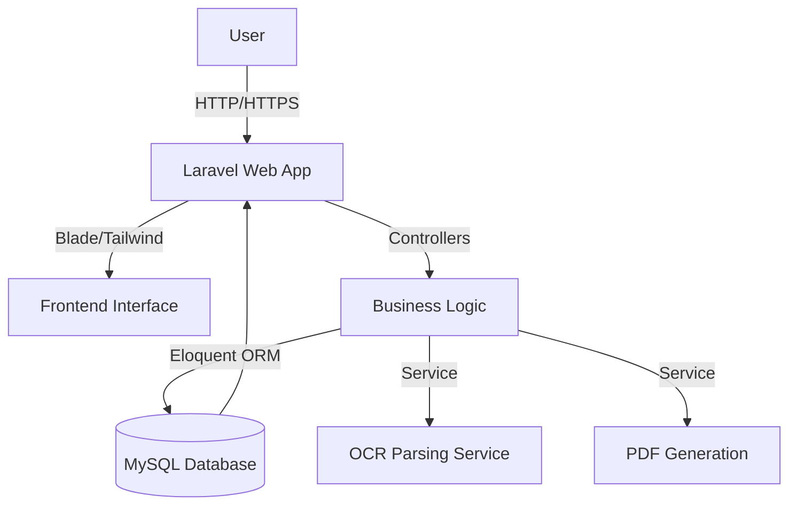

# Havells ERP+CRM
**Enterprise Resource Planning & Customer Relationship Management System**
*Streamlining Business Operations, Inventory, and Vendor Management*

---

# Problem Statement
- **Fragmented Data:** Tracking sales, inventory, and vendor POs across disparate systems leads to inefficiency.
- **Manual Data Entry:** Extracting bill info manually is time-consuming and prone to human error.
- **Limited Visibility:** Lack of a unified dashboard for admin and employees hampers quick decision-making.
- **Complex Operations:** Managing societies, contractors, leads, quotations, and ticketing is chaotic without a unified workflow.

---

# Tech Stack

**Frontend:**
- Laravel Blade Templates
- TailwindCSS v4 with Vite
- Axios for API calls

**Backend:**
- PHP 8.2 & Laravel 12
- Spatie Permissions & ActivityLog
- DomPDF for PDF Generation (Invoices, Quotations)

**Database & Hosting:**
- MySQL
- Queue / Session: Database-driven
- Broadcast: Log / Setup ready

---

# Architecture / System Design



---

# Key Features

- **Comprehensive Dashboard:** Admin & Employee portals with Role-Based Access Control (RBAC).
- **Vendor PO & Invoice Management:** Create, track, and manage vendor purchase orders and invoices.
- **Smart OCR Integration:** Auto-parse GST bills (photos) to auto-fill PO details.
- **Inventory & Warehouse Management:** Stock reconciliation, stock-in/out, and transactions logging.
- **CRM & Ticketing:** Manage leads, customers, appointments, and support tickets.
- **Accounting:** Journal entries, balance sheet, and profit-loss reports.
- **WhatsApp Integration:** Webhooks and messaging for customer engagement.

---

# Code Highlights

**OCR Bill Parsing Logic (VendorPoController.php):**
```php
public function ocrParseBill(Request $request) {
    // Validates uploaded image/PDF
    // Mocked extraction simulating an OCR integration for GST invoices
    $extractedData = [
        'vendor_name' => 'Proxima Piping Systems',
        'subtotal' => 35.71,
        'grand_total' => 42.00,
        // ... Parses item details, GST percent, HSN codes
    ];
    // Auto-creates supplier if not found
    $vendor = Supplier::firstOrCreate(['name' => $extractedData['vendor_name']]);
    return response()->json(['success' => true, 'data' => $extractedData]);
}
```
*Automatically populates complex PO forms from an uploaded bill.*

---

# Database Schema Overview

**Key Modules & Tables:**
- **Users & Auth:** `users`, `roles`, `permissions`, `activity_log`
- **CRM Core:** `customers`, `leads`, `societies`, `appointments`
- **Inventory:** `products`, `warehouses`, `stock_transactions`, `material_logs`
- **Sales & Operations:** `quotations`, `invoices`, `tasks`, `tickets`, `shipments`
- **Accounts:** `accounts`, `journal_entries`, `payments`, `credit_debit_notes`
- **Vendors:** `contractors`, `suppliers`, `vendor_pos`, `vendor_invoices`

---

# Challenges & Solutions

- **Challenge:** Creating complex POs from supplier bills is highly error-prone.
  - **Solution:** Implemented OCR endpoint that auto-reads GST bills and maps items, HSN codes, and taxes to the PO creation form.
- **Challenge:** Managing multi-tenant/branch data and diverse user roles (Admin vs. Employee).
  - **Solution:** Integrated `spatie/laravel-permission`, assigned branch-specific filters, and implemented strict middleware routing.
- **Challenge:** Complex tax and accounting reconciliation.
  - **Solution:** Built custom journal entry controllers and double-entry accounting tables linked directly to invoices.

---

# Future Scope

- **Real OCR Integration:** Connect the mocked OCR endpoint to AWS Textract or Google Cloud Vision API for dynamic real-world invoice reading.
- **AI-Powered Analytics:** Use LLMs to generate insights from sales trends and customer tickets.
- **Mobile Application:** A native React Native / Flutter app for field agents (contractors/employees) to manage appointments and upload bills on the go.
- **Automated Tax Filing:** Direct API integration with government GST portals.

---

# Conclusion

- **Havells ERP+CRM** is a robust, end-to-end platform tailored for scalable enterprise operations.
- By combining **inventory tracking, automated accounting, and OCR-assisted data entry**, it significantly reduces operational overhead.
- Built on modern **Laravel 12** and **TailwindCSS**, it is fast, secure, and ready for future integrations.

**Thank You!**
